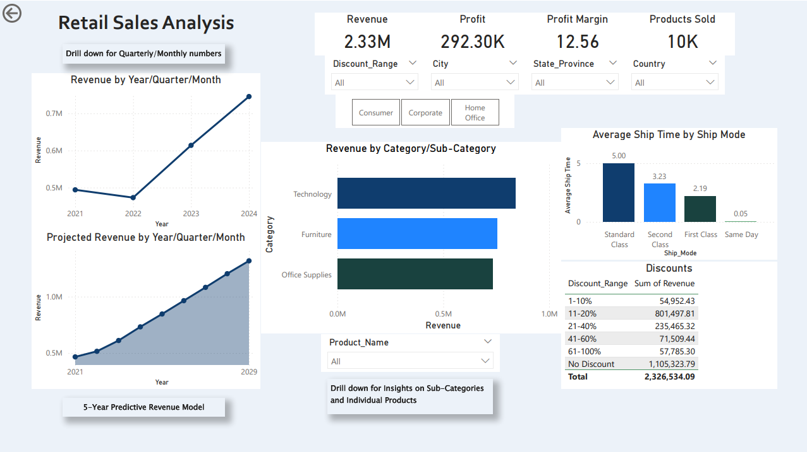

# Retail Sales & Profitability Analysis
**Author:** Krastiu Dimov  
**Tools Used:** SQL, Python (Prophet), Power BI  

---

## Project Overview
Analyzed 10,195 historical retail transactions (2019–2024) to optimize **revenue growth, profitability, and operational efficiency**. Delivered actionable insights on **high-margin products, discount strategy, segment profitability, shipping efficiency**, and future revenue forecasts.

---

## Business Challenge
The client needed to answer:  
1. Which segments and product categories drive profitability?  
2. How do discount strategies affect margins?  
3. What is the projected revenue outlook, and how should operations plan?  

---

## Key Findings

### Segment Profit Contribution
| Segment       | Profit % |
|---------------|-----------|
| Consumer      | 46.65     |
| Corporate     | 32.25     |
| Home Office   | 21.10     |

### Category Profit Contribution
| Category        | Profit % |
|-----------------|-----------|
| Technology      | 50.14     |
| Office Supplies | 43.11     |
| Furniture       | 6.75      |

### Discount Impact ($ Lost Profit)
| Discount Range | Profit Loss |
|----------------|-------------|
| 21–40%         | 39,130      |
| 41–60%         | 29,164      |
| 61–100%        | 70,866      |

### Peak Season Dependency
| Year | Peak Revenue | Total Revenue | % Annual Revenue |
|------|--------------|---------------|-----------------|
| 2021 | 233,505      | 494,040       | 47.26%          |
| 2022 | 216,132      | 472,923       | 45.69%          |
| 2023 | 250,436      | 613,934       | 40.79%          |
| 2024 | 291,694      | 745,567       | 39.12%          |

### Shipping Efficiency
| Mode        | Avg Delivery Days |
|-------------|-----------------|
| Same Day    | 0.04            |
| First Class | 2.18            |
| Second Class| 3.24            |
| Standard    | 5.00            |

### Top 5 Product Revenue Contribution
| Product                                   | Revenue ($) | % of Total Revenue |
|------------------------------------------|-------------|------------------|
| Canon imageCLASS 2200 Copier             | 61,599.83   | 2.65%            |
| Fellowes PB500 Electric Punch             | 27,453.38   | 1.18%            |
| Cisco TelePresence EX90                   | 22,638.48   | 0.97%            |
| HON 5400 Series Task Chair                | 21,870.57   | 0.94%            |
| GBC DocuBind TL300                         | 19,823.47   | 0.85%            |

---

## Recommendations & Business Impact
- **Optimize Discounts:** Cap discounts >20% to recover $139k+ in lost profit.  
- **Category Focus:** Prioritize Technology & Office Supplies (~93% of profit).  
- **Segment Strategy:** Target Consumer growth; improve Corporate/Home Office profitability.  
- **Operational Efficiency:** Reduce Standard Class delivery lag (5 days) using faster shipping.  
- **Forecast-Driven Planning:** Align inventory & staffing with peak months (Sep, Nov–Dec).  

---

## Forecast & Predictive Insights
- 5-year revenue projection shows steady growth with continued Q4 dependency.  
- Enables proactive inventory and operational planning to maximize profitability.  

---

## Deliverables
- **SQL Scripts:** Data cleaning, KPI calculations, discount impact analysis.  
- **Python Forecast Model:** 5-year revenue projection.  
- **Power BI Dashboard:** Interactive exploration of revenue, profit, discounts, and forecasts.  
- **Slide Deck:** Executive-ready insights, recommendations, and business impact.  

---

## Visuals (Placeholders)
- **Dashboard:**  

